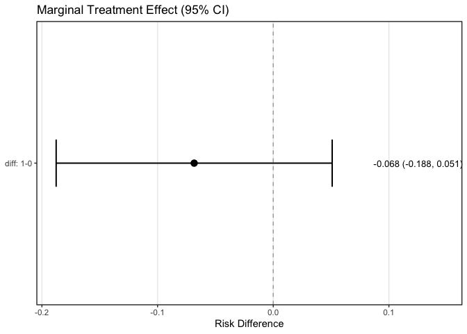
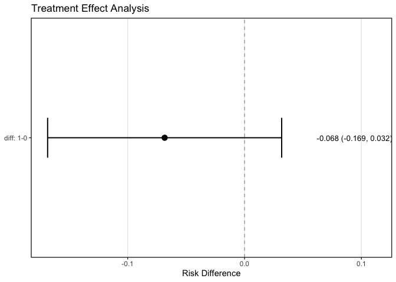

<!-- README.md is generated from README.Rmd. Please edit that file -->

# Binary Endpoint Estimation with Covariate Adjustment

<!-- badges: start -->

[](https://lifecycle.r-lib.org/articles/stages.html#stable)

[](https://github.com/openpharma/beeca/actions/workflows/R-CMD-check.yaml)
[](https://github.com/openpharma/beeca/actions/workflows/test-coverage.yaml)
<!-- badges: end -->

The goal of **beeca** is to provide an implementation solution with a
simple user interface to estimate marginal estimands in a binary
endpoint setting with covariate adjustment. The primary aim of this
lightweight implementation is to facilitate quick industry adoption and
use within GxP environments. A secondary aim is to support the
simulation studies included in [Magirr et
al. (2025)](https://doi.org/10.1002/pst.70021).

## Installation

| Type        | Source | Command                                       |
|-------------|--------|-----------------------------------------------|
| Development | GitHub | `remotes::install_github("openpharma/beeca")` |
| Release     | CRAN   | `install.packages("beeca")`                   |

## Methodology

Motivated by the recent [FDA guidance
(2023)](https://www.fda.gov/regulatory-information/search-fda-guidance-documents/adjusting-covariates-randomized-clinical-trials-drugs-and-biological-products)
on “Adjusting for Covariates in Randomized Clinical Trials for Drugs and
Biological Products Guidance for Industry” and its recommendations on
robust variance estimation, we implemented two approaches, namely [Ge et
al. (2011)](https://link.springer.com/article/10.1177/009286151104500409)
and [Ye et al. (2023)](https://doi.org/10.1080/24754269.2023.2205802),
to perform variance estimation for a treatment effect estimator based on
g-computation under a logistic regression working model.

## Scope

The package is designed to estimate marginal (unconditional) estimands
in a binary endpoint setting with covariate adjustment. It is suited for
clinical trials with or without covariate adaptive (stratified permuted
block or biased coin) randomization where the summary measure of the
marginal estimand is one of (risk difference, odds ratio, risk ratio,
log odds ratio, log risk ratio). For practical considerations on the
implications of covariate adjustment in superiority vs non-inferiority
trials, please see [Nicholas et
al. (2015)](https://doi.org/10.1002/sim.6447) and [Morris et
al. (2022)](https://doi.org/10.1186/s13063-022-06097-z).

## Examples

### Quick Start with `beeca_fit()`

The `beeca_fit()` function provides a streamlined workflow for
covariate-adjusted analysis:

``` r
library(beeca)

## Quick analysis with beeca_fit()
fit <- beeca_fit(
  data = trial01,
  outcome = "aval",
  treatment = "trtp",
  covariates = "bl_cov",
  method = "Ye",
  contrast = "diff"
)
#> Converting 'trtp' to factor
#> Warning: 1 observation(s) with missing data will be excluded
#> Fitting logistic regression with 1 covariate(s)
#> Computing marginal effects (method: Ye, contrast: diff)
#> Warning: There is 1 record omitted from the original data due to missing
#> values, please check if they should be imputed prior to model fitting.
#> Warning: No reference argument was provided, using {0} as the reference
#> level(s)
#> Analysis complete!

## View concise results
print(fit)
#> beeca: Covariate-Adjusted Marginal Treatment Effect
#> =======================================================
#> 
#> Contrast:  diff: 1-0
#> Estimate:  -0.0684 (SE = 0.0609)
#> Z-value:   -1.1229
#> P-value:   0.2615
#> 
#> Use summary() for detailed results
#> Use tidy() for broom-compatible output
#> Use plot() for visualizations

## View detailed results
summary(fit)
#> 
#> Covariate-Adjusted Marginal Treatment Effect Analysis
#> ============================================================
#> 
#> Model Information:
#> ------------------------------------------------------------
#>   Working model:      Logistic regression with covariate adjustment
#>   Variance estimator: Ye
#>   Contrast type:      diff
#>   Sample size:        267
#>   Outcome variable:   aval
#> 
#> Marginal Risks (g-computation):
#> ------------------------------------------------------------
#>  Treatment Risk   SE     95% CI          
#>  0         0.4875 0.0435 (0.4022, 0.5728)
#>  1         0.4191 0.0427 (0.3354, 0.5028)
#> 
#> Treatment Effect Estimates:
#> ------------------------------------------------------------
#>  Comparison Estimate SE     Z value 95% CI            P value
#>  diff: 1-0  -0.0684  0.0609 -1.1232 (-0.1878, 0.0510) 0.26   
#> 
#> ------------------------------------------------------------
#> Note: Standard errors and tests based on robust variance estimation
#> Use tidy() for data frame output or plot() for visualizations
```

``` r
## Create forest plot
plot(fit)
```



### Manual Workflow

For more control over the analysis, use the manual workflow:

``` r
library(beeca)

## Set treatment to a factor
trial01$trtp <- factor(trial01$trtp)

## Fit a logistic regression working model and pass it to beeca
fit1 <- glm(aval ~ trtp + bl_cov, family = "binomial", data = trial01) |>
  get_marginal_effect(trt = "trtp", method = "Ye", contrast = "diff")
#> Warning: There is 1 record omitted from the original data due to missing
#> values, please check if they should be imputed prior to model fitting.
#> Warning: No reference argument was provided, using {0} as the reference
#> level(s)

## View the results in Analysis Results Data (ARD) structure
fit1$marginal_results
#> # A tibble: 12 × 8
#>    TRTVAR TRTVAL    PARAM ANALTYP1    STAT     STATVAL ANALMETH      ANALDESC   
#>    <chr>  <chr>     <chr> <chr>       <chr>      <dbl> <chr>         <chr>      
#>  1 trtp   0         aval  DESCRIPTIVE N       133      count         Computed u…
#>  2 trtp   0         aval  DESCRIPTIVE n        65      count         Computed u…
#>  3 trtp   0         aval  DESCRIPTIVE %        48.9    percentage    Computed u…
#>  4 trtp   0         aval  INFERENTIAL risk      0.487  g-computation Computed u…
#>  5 trtp   0         aval  INFERENTIAL risk_se   0.0435 Ye            Computed u…
#>  6 trtp   1         aval  DESCRIPTIVE N       134      count         Computed u…
#>  7 trtp   1         aval  DESCRIPTIVE n        56      count         Computed u…
#>  8 trtp   1         aval  DESCRIPTIVE %        41.8    percentage    Computed u…
#>  9 trtp   1         aval  INFERENTIAL risk      0.419  g-computation Computed u…
#> 10 trtp   1         aval  INFERENTIAL risk_se   0.0427 Ye            Computed u…
#> 11 trtp   diff: 1-0 aval  INFERENTIAL diff     -0.0684 g-computation Computed u…
#> 12 trtp   diff: 1-0 aval  INFERENTIAL diff_se   0.0609 Ye            Computed u…

## Or use the tidy method for broom-compatible output
tidy(fit1, conf.int = TRUE)
#> # A tibble: 1 × 7
#>   term      estimate std.error statistic p.value conf.low conf.high
#>   <chr>        <dbl>     <dbl>     <dbl>   <dbl>    <dbl>     <dbl>
#> 1 diff: 1-0  -0.0684    0.0609     -1.12   0.261   -0.188    0.0510

## Include marginal risk estimates for each treatment arm
tidy(fit1, include_marginal = TRUE, conf.int = TRUE)
#> # A tibble: 3 × 7
#>   term      estimate std.error statistic  p.value conf.low conf.high
#>   <chr>        <dbl>     <dbl>     <dbl>    <dbl>    <dbl>     <dbl>
#> 1 risk_0      0.487     0.0435     11.2  3.84e-29    0.402    0.573 
#> 2 risk_1      0.419     0.0427      9.82 9.39e-23    0.335    0.503 
#> 3 diff: 1-0  -0.0684    0.0609     -1.12 2.61e- 1   -0.188    0.0510
```

``` r
## Create a forest plot with customization
plot(fit1, conf.level = 0.90, title = "Treatment Effect Analysis")
```



## Package documentation

The package documentation can be found
[here](https://openpharma.github.io/beeca/). For a brief overview of the
different estimands and their estimation, please see vignette
[`vignette("estimand_and_implementations")`](https://openpharma.github.io/beeca/articles/estimand_and_implementations.html).

## Quality checks

Where possible we have cross checked the {beeca} package with
alternative implementations in `SAS` and `R`. For example, the Ge et
al. method which applies the delta method has been cross checked against
the `SAS` [%margins](https://support.sas.com/kb/63/038.html) macro and
the R packages [{margins}](https://cran.r-project.org/package=margins)
and
[{marginaleffects}](https://cran.r-project.org/package=marginaleffects).
The Ye et al. method has been cross checked against
[{RobinCar}](https://cran.r-project.org/package=RobinCar/).

## Package authors

- [Alex
  Przybylski](mailto:alexander.przybylski@novartis.com?subject=beeca)
- [Craig Wang](mailto:craig.wang@novartis.com?subject=beeca)
- [Dominic Magirr](mailto:dominic.magirr@novartis.com?subject=beeca)
- [Mark Baillie](mailto:mark.baillie@novartis.com?subject=beeca)

## Acknowledgments

Our lightweight implementation was inspired and aided by the more
comprehensive [{RobinCar}](https://cran.r-project.org/package=RobinCar/)
package, developed by Marlena Bannick, Ting Ye et al. We thank the
[ASA-BIOP Covariate Adjustment Scientific Working
Group](https://carswg.github.io/) for valuable feedback and discussions.

Further development of covariate adjustment software is by the [Software
Subteam](https://carswg.github.io/subteam_software.html) of ASA-BIOP
Covariate Adjustment Scientific Working Group.

## References

- FDA. 2023. “Adjusting for Covariates in Randomized Clinical Trials for
  Drugs and Biological Products. Final Guidance for Industry.”
  <https://www.fda.gov/regulatory-information/search-fda-guidance-documents/adjusting-covariates-randomized-clinical-trials-drugs-and-biological-products>

- Ge, Miaomiao, L Kathryn Durham, R Daniel Meyer, Wangang Xie, and Neal
  Thomas. 2011. “Covariate-Adjusted Difference in Proportions from
  Clinical Trials Using Logistic Regression and Weighted Risk
  Differences.” *Drug Information Journal: DIJ/Drug Information
  Association* 45: 481–93. <https://doi.org/10.1177/009286151104500409>

- Magirr, Dominic, Craig Wang, Alexander Przybylski, and Mark
  Baillie. 2025. “Estimating the Variance of Covariate-Adjusted
  Estimators of Average Treatment Effects in Clinical Trials With Binary
  Endpoints.” *Pharmaceutical Statistics* 24 (4): e70021.
  <https://doi.org/10.1002/pst.70021>

- Ye, Ting, Marlena Bannick, Yanyao Yi, and Jun Shao. 2023. “Robust
  Variance Estimation for Covariate-Adjusted Unconditional Treatment
  Effect in Randomized Clinical Trials with Binary Outcomes.”
  *Statistical Theory and Related Fields* 7 (2): 159–63.
  <https://doi.org/10.1080/24754269.2023.2205802>
